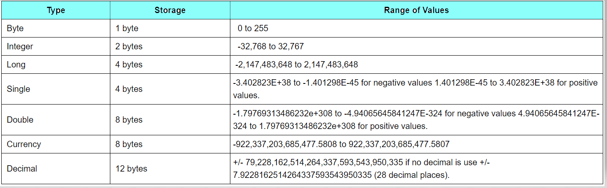
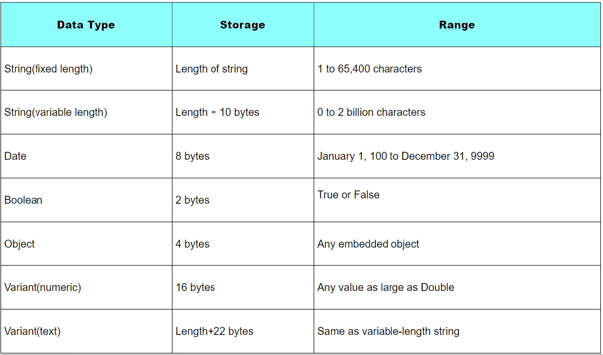
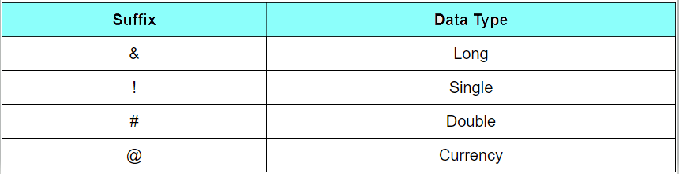
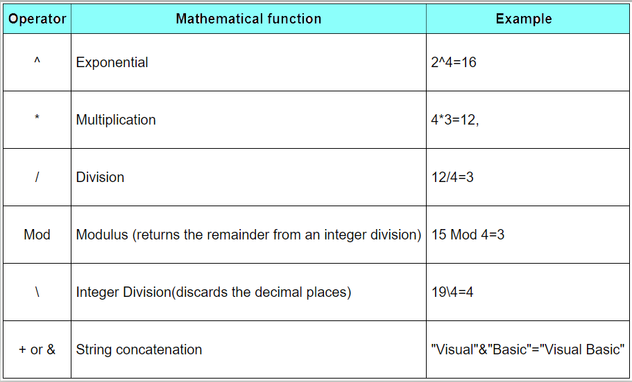

### DATA TYPES IN VB6  
* To Handle all different Types of information, VB classifies the information into 2 kinds
  * Numeric
  * Non-Numeric Data Types

##### Numeric DataTypes  
* Consist of numbers that can be computed mathematically with standard operators.  
  
* Single and Double decision data types, are also called as floating point numbers.  

##### Non-Numeric DataTypes  
*  string data types, date data types, boolean data types that store only two values (true or false),  
   object data type and Variant data type.  
   
##### Suffixes for Literals
* Literals are values that you assign to data.  
* In some cases, we need to add a suffix behind a literal so that VB can handle the calculation more accurately.
* **Eg:**   number=3.89! for Single Data Type  
  
##### Variables  
> Naming Convention  
```
* It must be less than 255 characters  
* No spacing is allowed  
* Can Contain UnderScore( _ )  
* Cannot repeat names within the same level of scope.  
* It must not begin with a number  
* Period is not permitted  
```
* you can declare Variable in separate lines or you may also combine more in one line , separating each variable with a comma.  
* Unlike other programming languages, Visual Basic actually doesn't require you to specifically declare a variable before it's used. 
* If a variable isn't declared, VB will automatically declare the variable as a Variant. 
* A variant is the data type that can hold any type of data.  
* **Strings** 
  * Variable Length String: As in below Example(Eg-1)  
  * Fixed Length String : 
   ```vb 
    Dim variableName as String * n 
   ```  
  where n is no. of characters to hold.
> Eg-1:  
```vb
Dim variable1 As Integer,variable2 As String  
Dim Variable3 AS Date  
Dim Total As Double
```  

> Declaring variable's  & it's Scope

 **Using**
* Dim : To Declare local variable  
* Private : Declares a local variable or a variable that is local to a procedure or module.  
* Static : Declares a variable that is being used multiple times, even after a procedure has been terminated.  
           Most variables created inside a procedure are discarded by VB when the procedure is finished.  
           But, static keyword *preserves* the *value of a variable* even after the *procedure is terminated*.
* Public : Declares a global variable(Available whole program)  
> Constants  
* Variables  whose values doesn't Change
* `Constant Name As Data Type = Value`
```vb 
Const Name As String = "DeepikaRuth"
```
> Assigning Values to Variables  

`Variable=Expression`  
**Note:**  We already Used Variable assigning in our Previous examples of  **FirstVBApplication.md**  
**Arithmetic Operators in VB**  
  

