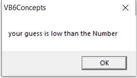
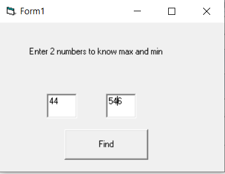
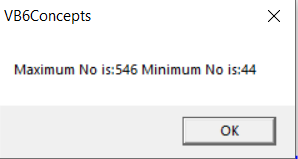
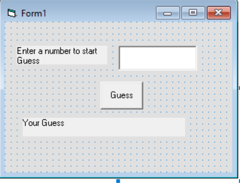
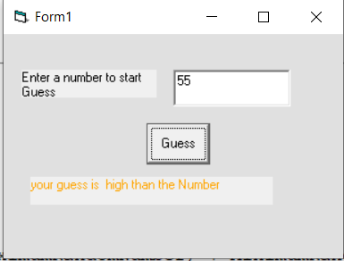
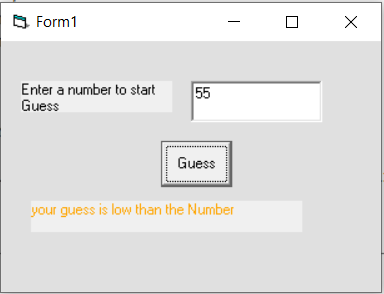
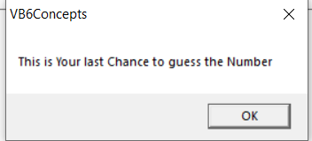
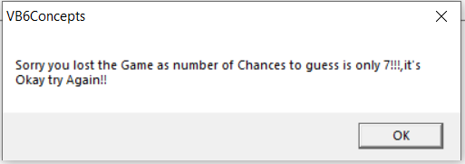

 * Decision making process is an important part of any programming Language.  
 Because, it can help to solve practical problems intelligently with user Interaction.
 ##### Conditional Operators 
    
 ##### Logical Operators  
   
 
 ##### If ..Then.. Else  
 **Note:** We already used if and else in **FirstVBApplication.md**
 ```vb
 If conditions Then

'VB expressions/statements

Else

'VB expressions/statements

End If  
```
> Example-1  

**Guess Game** 
##### Guess Form 
   

```vb
Dim NumberTobeGuessed As Integer
Dim MaximumRandomNumber As Integer
Dim MinimumRandomNumber As Integer
Dim RandomCounter As Integer
Private Sub Form_Load()

MaximumRandomNumber = 100
MinimumRandomNumber = 1

Randomize Timer

  For RandomCounter = 1 To 10

    NumberTobeGuessed = Int(Rnd(1) * MaximumRandomNumber) + MinimumRandomNumber

  Next
End Sub

Private Sub Ok_cmd_Click()

    If Val(Text1) > NumberTobeGuessed Then
     MsgBox ("your guess is  high than the Number")
    ElseIf Val(Text1) < NumberTobeGuessed Then
     MsgBox ("your guess is low than the Number")
    Else
     MsgBox ("you are absolutely correct")
     Text1 = 0
    End If
End Sub

```  
##### Output  
  
     
  
     
   
 #### IIf() Function 
 `IIf(A, B, C)`  
* A represents a logical expression while B and C represent a numeric or a string expression.  
> Maximum and Minimum Number Example Using **IIF()**  

 
```vb
Dim MaxNum As Long
Dim MinNum As Long
Private Sub Command1_Click()
    MaxNum = IIf((Text1) > (Text2), Text1, Text2)
   If (MaxNum <> Text1) Then
    MinNum = Text1
    Else
    MinNum = Text2
   End If
   
    MsgBox ("Maximum No is:" & MaxNum & " Minimum No is:" & MinNum)
End Sub
```
#### Output
  
#### Select Case  
* *Select Case* control structure can handle conditions with multiple outcomes in an easier manner than the ***If...Then...ElseIf*** control structure.
> syntax  
```vb
Select Case expression
 Case case1
	 'one or  more VB statements
	Case case2
	'one or more VB Statements
 Case Else
 'one or more VB Statements
End Select
```
> Guess Game  
####Form  
 
```vb
Dim NumberTobeGuessed As Integer
Dim MaximumRandomNumber As Integer
Dim MinimumRandomNumber As Integer
Dim RandomCounter As Integer
Dim No_Of_Guesses As Integer

Private Sub Form_Load()

No_Of_Guesses = 7
MaximumRandomNumber = 100
MinimumRandomNumber = 1

Randomize Timer

  For RandomCounter = 1 To 10
    NumberTobeGuessed = Int(Rnd(1) * MaximumRandomNumber) + MinimumRandomNumber
  Next
End Sub

Private Sub Guess_Command1_Click()
No_Of_Guesses = No_Of_Guesses - 1
Label2.ForeColor = RGB(255, 165, 0)
 If No_Of_Guesses <> 0 Then
  Select Case Val(Text1)
    Case Is > NumberTobeGuessed
    Label2 = "your guess is  high than the Number"
    Case Is < NumberTobeGuessed
    Label2 = "your guess is low than the Number"
    Case Else
     Beep
     Label2 = "you are absolutely correct! Congratulations"
     Text1 = 0
  End Select
   If No_Of_Guesses = 1 Then
    MsgBox ("This is Your last Chance to guess the Number")
   End If
  Else
  MsgBox ("Sorry you lost the Game as number of Chances to guess is only 7!!!,it's Okay try Again!!")
  Text1 = 0
 End If
End Sub
```  
#### Output


 

 
