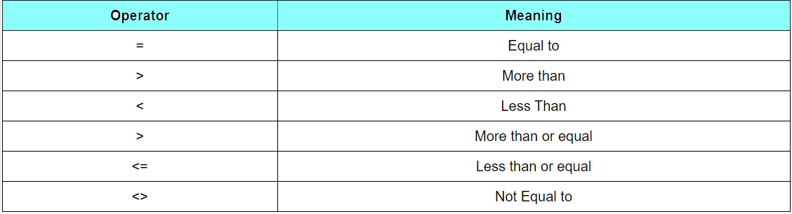
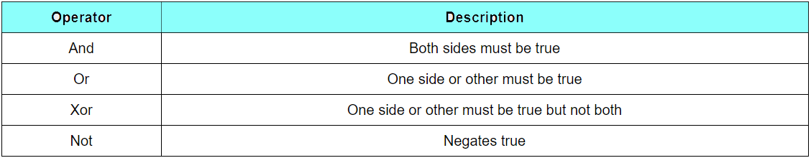

 * Decision making process is an important part of any programming Language.  
 Because, it can help to solve practical problems intelligently with user Interaction.
 ##### Conditional Operators 
    
 ##### Logical Operators  
   
 
 ##### If ..Then.. Else  
 **Note:** We already used if and else in **FirstVBApplication.md**
 ```vb
 If conditions Then

'VB expressions/statements

Else

'VB expressions/statements

End If  
```
> Example-1  

**Guess Game**  

 
