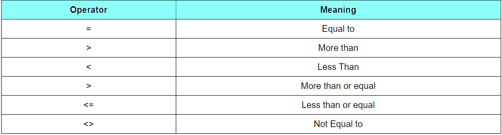
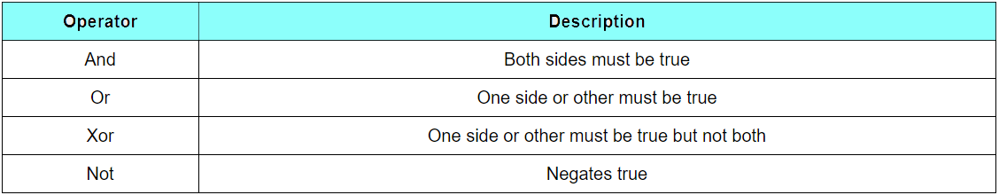
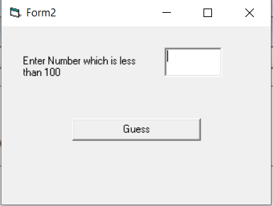
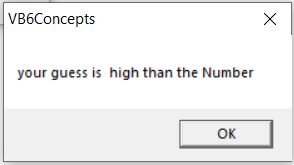
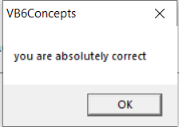

 * Decision making process is an important part of any programming Language.  
 Because, it can help to solve practical problems intelligently with user Interaction.
 ##### Conditional Operators 
    
 ##### Logical Operators  
   
 
 ##### If ..Then.. Else  
 **Note:** We already used if and else in **FirstVBApplication.md**
 ```vb
 If conditions Then

'VB expressions/statements

Else

'VB expressions/statements

End If  
```
> Example-1  

**Guess Game** 
##### Guess Form 
   

```vb
Dim NumberTobeGuessed As Integer
Dim MaximumRandomNumber As Integer
Dim MinimumRandomNumber As Integer
Dim RandomCounter As Integer
Private Sub Form_Load()

MaximumRandomNumber = 100
MinimumRandomNumber = 1

Randomize Timer

  For RandomCounter = 1 To 10

    NumberTobeGuessed = Int(Rnd(1) * MaximumRandomNumber) + MinimumRandomNumber

  Next
End Sub

Private Sub Ok_cmd_Click()

    If Val(Text1) > NumberTobeGuessed Then
     MsgBox ("your guess is  high than the Number")
    ElseIf Val(Text1) < NumberTobeGuessed Then
     MsgBox ("your guess is low than the Number")
    Else
     MsgBox ("you are absolutely correct")
     Text1 = 0
    End If
End Sub

```  
##### Output  
  
     
  
     
   
 #### IIf() Function  
 `IIf(A, B, C)`  
   * A represents a logical expression while B and C represent a numeric or a string expression.  
   > Maximum and Minimum Number Example Using **IIF()**  
   
