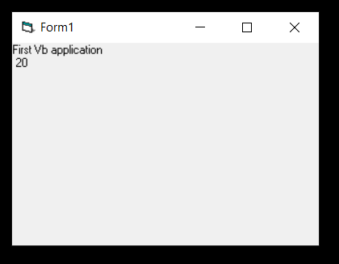
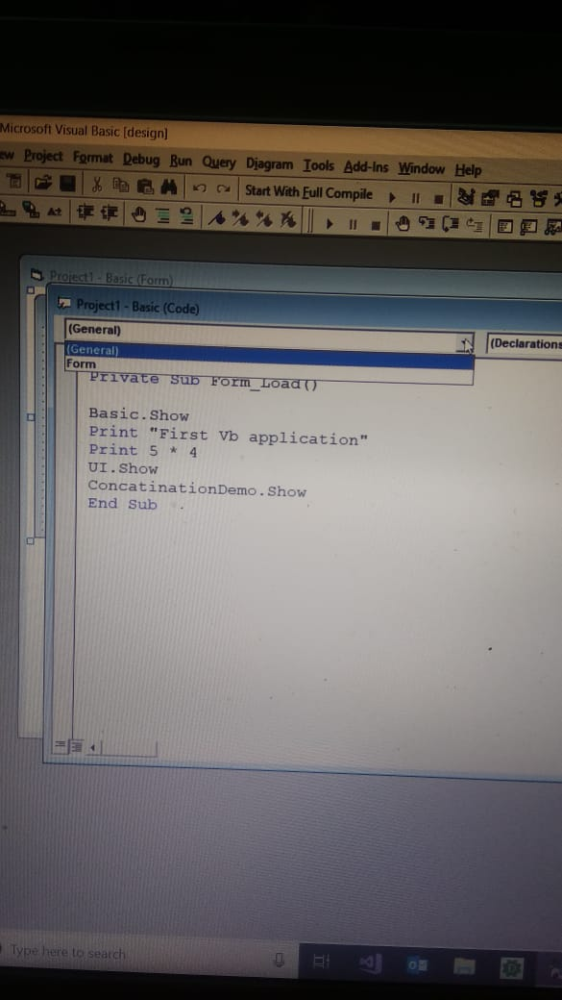
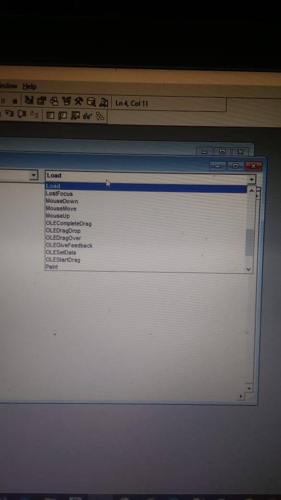
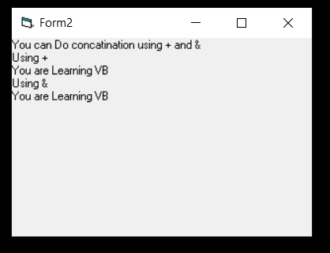
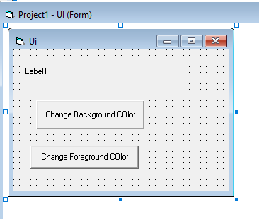
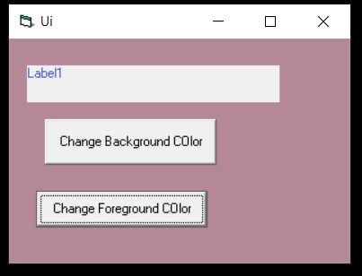

### Creating Your First Application  
1.Open the VB6 Compiler,Select New `Standard EXE` to enter into `integrated development environment`.  
2.Default Form with Form1 is presented to you.Double click the form1 to bring up the Source code window of form1.  
3.Source code window consists of a list of objects and their associated events or procedures.  
4.**Eg**: **Form1** associated procedure is **Load**  

```vb
Private Sub Form_Load()

Form1.Show
Print "First Vb application"
Print 5 * 4

End Sub
 ```
  ##### Output:
 
 
 ***Object Box*** drop down list  , displays  list of objects that are associated with your form.  
 **Image of Our Form Objects:**  
 *As of now we have only one object i.e; **Form** so, we got only one dropdown*
   
 ***Procedure Box*** drop down list  , displays  list of procedures we can add to our form to perform certain tasks(click event or mouse over event etc.,)  
 **Image of Our Procedure Events Which we can use for our form:**  
 *It's just a sample image,we have more functions*
   
 
 - The Content between the `Private Sub Form_Load()` and `End sub` is displayed when you run the program.  
     - **Click f5** to run the Program
 -  `Form1.Show` is used to show the form1 content.  
 -  `Print` is used to display content on Output Screen.
 
 ###### Example 2
 ``` vb
 Private Sub Form_Load()

 variabe1 = "You"
 variabe2 = "are"
 variabe3 = "Learning"
 variabe4 = "VB"
 ConcatinationDemo.Show
  Print "You can Do concatination using + and & "
  Print "Using +"
  Print variabe1 + " " + variabe2 + " " + variabe3 + " " + variabe4
  Print "Using &"
  Print variabe1 & " " & variabe2 & " " & variabe3 & " " & variabe4

End Sub
```
  ##### Output:
 
      
 ###### Example 3
  *This is a demo to change change background and fore ground color of the form with click event handlers and a simple label Message*
   
  ```vb
  Private Sub Command1_BGColor_Click()

Dim r, g, b As Integer
r = Int(Rnd() * 256)
g = Int(Rnd() * 256)
b = Int(Rnd() * 256)
UI.BackColor = RGB(r, g, b)

End Sub

Private Sub Command2_foreColor_Click()
Dim r, g, b As Integer
r = Int(Rnd() * 256)
g = Int(Rnd() * 256)
b = Int(Rnd() * 256)
Label1.ForeColor = RGB(r, g, b)
End Sub

Private Sub Label1_Click()
 Print "change text Color"
End Sub
  ```
  
 ##### Output:
 
     
     
