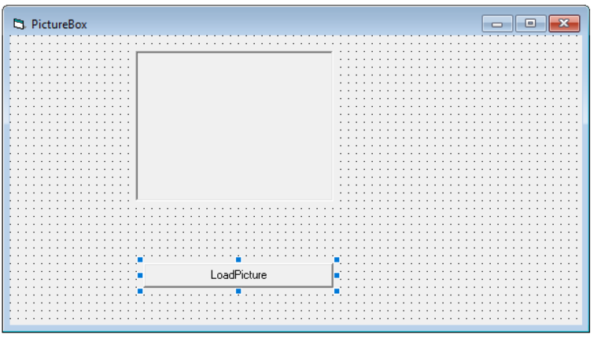
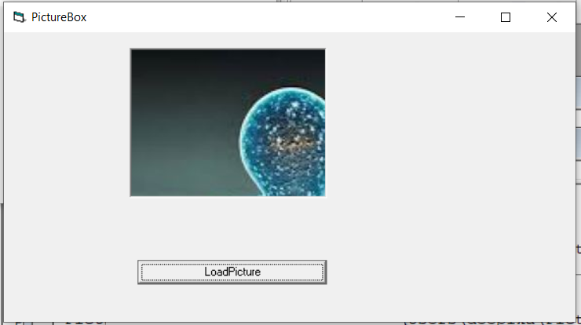
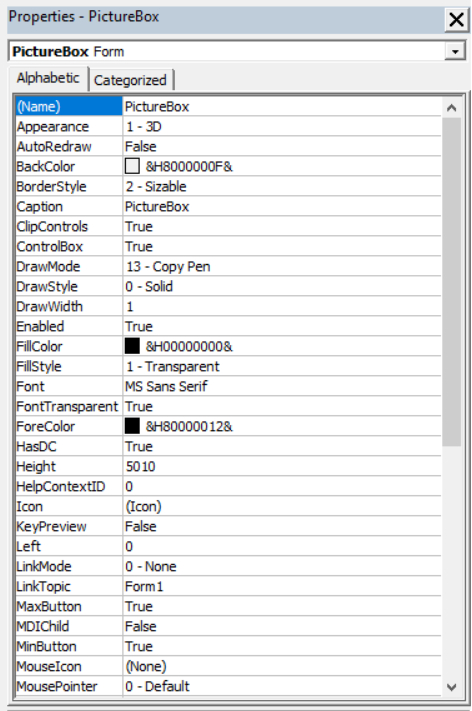
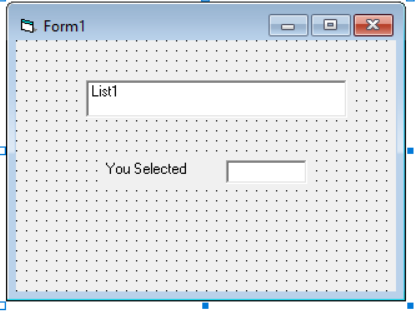
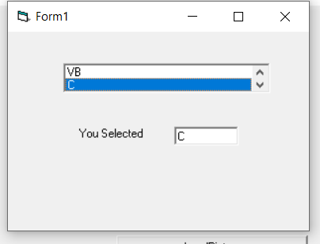
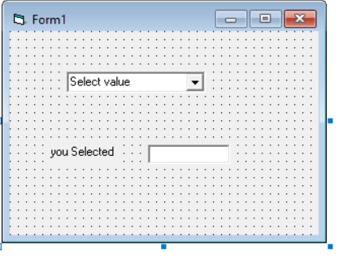
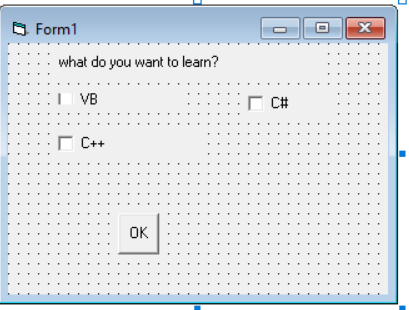
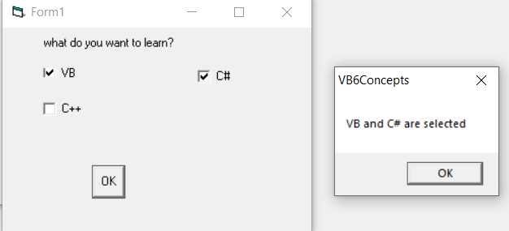
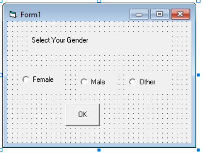
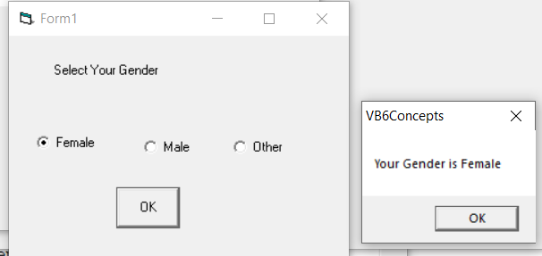

# Glimpse Of Tool Box Controls  
**Note:** We will be see the xamples that are mostly used.
###### TOOL BOX IMAGE
  
     
  >*We already used **Command and Label Controls** in Previous Examples.So, let's create examples for other Controls*  
  
#### TEXT BOX  
* Used To Accept User Input(string/number)  
* A string entered into a text box can be converted to a numeric data by using the function Val(text).

###### Example  
###### TEXT BOX FORM
    
     
```vb
Private Sub add_Click()
Result = Val(num1) + Val(num2)
End Sub
```
##### Output  
  
     
###### Example 2  
###### PASSWORD FORM  

    
     
```vb
Private Sub pswd_Click()
 Dim EnteredPassword As String
 EnteredPassword = password.Text
 MsgBox ("Your password is: " & EnteredPassword)
End Sub
```
###### Note: **Dim** is used to declare varaibles in **VB6**,we'll go into details in Variables Section.So, don't worry as of now.
##### Output  
  
     
#### PICTURE BOX  
*  Used to handle 
* load the picture at runtime using the LoadPicture method.
###### PICTURE BOX FORM  

  
 ```vb
Private Sub LoadPicture_cmd_Click()
 Picture1.Picture = LoadPicture("C:\Users\deepika\Pictures\webimjage2.jpg")
End Sub

Private Sub Picture1_Click()
Picture1.Picture = LoadPicture("C:\Users\deepika\Pictures\webimjage2.jpg")
End Sub
  ```  
  
  ##### Output  
  
    
     
  * We can Change the Properties of Image using the properties of PictureBox  
  
      
     
#### LIST BOX  
     * List Box is used to present a list of items where the user can click and select the items from the list.  
     * To add items to the list, we can use the **AddItem method**.  
###### ListBox Form  
     
  
     
```vb  
Private Sub Form_Load()
 List1.AddItem "VB"
 List1.AddItem "C"
 List1.AddItem "C++"
 List1.AddItem "C#"
End Sub

Private Sub List1_Click()
 Text1 = List1.Text
End Sub
```  
#### Output  

 
#### COMBO BOX  
* *Combo Box* is also used to present list of items as a DROP DOWN LIST, Where user clicks and selects item from drop down.  
* Same  **AddItem method**  used to add list items to the drop down as in  *list box*.  
###### COMBO BOX FORM  
  
     
```vb  
    Private Sub Combo1_Click()
        Text1 = Combo1.Text
    End Sub
    
    Private Sub Form_Load()
        Combo1.AddItem "VB"
        Combo1.AddItem "C"
        Combo1.AddItem "C++"
        Combo1.AddItem "C#"
    End Sub  
 ```  
#### Output  
  
#### CHECK BOX  
* Check Box control lets the user  selects or unselects an option.
* When the Check Box is checked, its value is set to 1 and when it is unchecked, the value is set to 0.  
###### CHECK BOX FORM  
  
     
```vb  
   Private Sub Command1_Click()
    If Check1.Value = 1 And Check2.Value = 0 And Check3.Value = 0 Then
      MsgBox "VB is selected"
    ElseIf Check2.Value = 1 And Check1.Value = 0 And Check3.Value = 0 Then
      MsgBox "C# is selected"
    ElseIf Check3.Value = 1 And Check1.Value = 0 And Check2.Value = 0 Then
      MsgBox "C++ is selected"
    ElseIf Check2.Value = 1 And Check1.Value = 1 And Check3.Value = 0 Then
      MsgBox "VB and C# are selected"
    ElseIf Check3.Value = 1 And Check1.Value = 1 And Check2.Value = 0 Then
      MsgBox "VB and C++ are selected"
    ElseIf Check2.Value = 1 And Check3.Value = 1 And Check1.Value = 0 Then
      MsgBox "C++ and C# are selected"
    Else
      MsgBox "All are selected"
   End If
  End Sub
 ```  
#### Output  
  
     
#### Option Button  
* *OptionButton* is radio button type,where user can select one of them(True/False).  

###### OPTION BUTTON FORM  
  
     
```vb  
   Private Sub Command1_Click()
    If Option1.Value = True Then
    MsgBox "Your Gender is Female"
    ElseIf Option2.Value = True Then
    MsgBox "Your Gender is Male"
    Else
    MsgBox "Your Gender is Other"
    End If
   End Sub
 ```  
#### Output  
  
