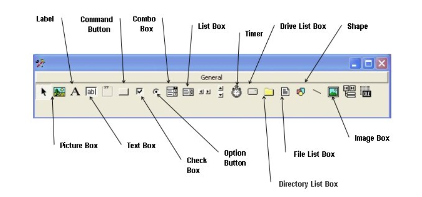
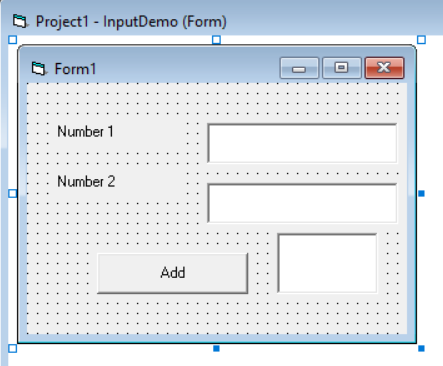
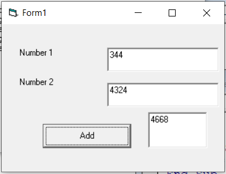
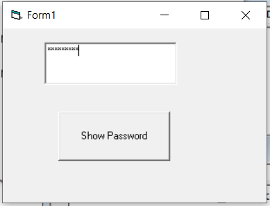
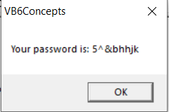

# Glimpse Of Tool Box Controls  


  
     
  >*We already used **Command and Label Controls** in Previous Examples.So, let's create examples for other Controls*  
  
#### TEXT BOX  
* Used To Accept User Input(string/number)  
* A string entered into a text box can be converted to a numeric data by using the function Val(text).

###### Example
    
     
```vb
Private Sub add_Click()
Result = Val(num1) + Val(num2)
End Sub
```
####Output  
  
     
###### Example 2  

    
     
```vb
Private Sub pswd_Click()
 Dim EnteredPassword As String
 EnteredPassword = password.Text
 MsgBox ("Your password is: " & EnteredPassword)
End Sub
```
#### Output  
  
     
